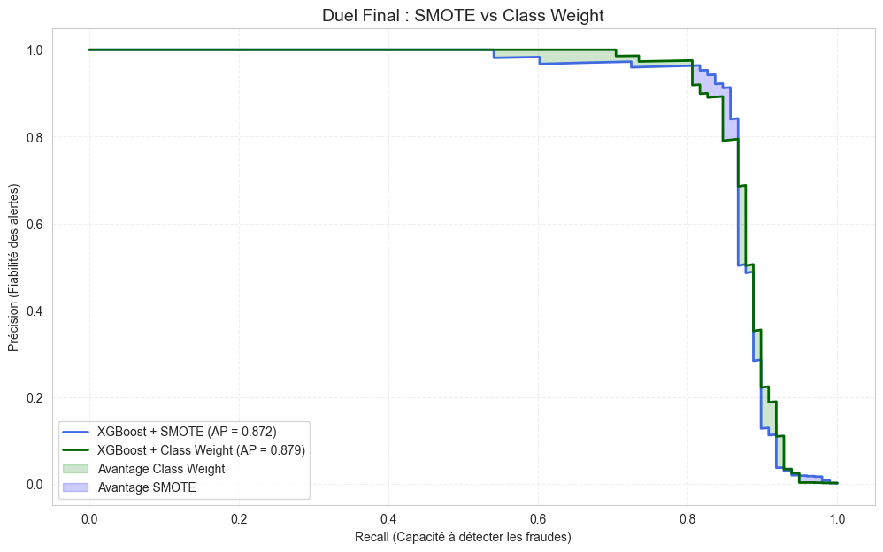

# Credit Card Fraud Detection: Imbalanced Data Strategies

This project implements a robust Machine Learning pipeline to detect fraudulent credit card transactions. The primary technical challenge addressed is **extreme class imbalance**, as fraudulent transactions represent only **0.17%** of the dataset.

## 📊 Project Overview
The objective is to maximize fraud detection (Recall) while minimizing false alarms (Precision) to ensure a seamless customer experience. We evaluated several state-of-the-art rebalancing techniques to find the optimal business trade-off.

## 🛠️ Methodology & Models
We benchmarked **Logistic Regression**, **Random Forest**, and **XGBoost** using four distinct strategies:
1. **Baseline:** Training on raw imbalanced data.
2. **SMOTE:** Synthetic Minority Over-sampling Technique.
3. **UnderSampling:** Balancing the classes by reducing the majority class.
4. **Class Weight:** Cost-sensitive learning by penalizing minority class errors (**Selected Champion**).

## 🏆 The Champion: XGBoost + Class Weight
The **XGBoost** model with optimized `scale_pos_weight` outperformed all other approaches by providing the best stability and precision.

| Metric | Score | Impact |
| :--- | :--- | :--- |
| **Average Precision (AP)** | **0.879** | Strong overall model discrimination. |
| **Precision** | **0.891** | High reliability; few false fraud alerts. |
| **Recall** | **0.837** | Captures the vast majority of fraudulent acts. |
| **F1-Score** | **0.863** | Excellent balance between Precision and Recall. |

## 📈 Performance Analysis
The comparison between **SMOTE** and **Class Weight** highlights that while SMOTE is effective, the **Class Weight** approach maintains significantly higher precision in critical operational zones, reducing "friction" for legitimate customers.

## 📁 Repository Structure
* `fraud_analysis.ipynb`: Full end-to-end data analysis and modeling.
* `requirements.txt`: List of Python dependencies for reproducibility.
* `final_curves_results.pkl`: Saved model metrics and curves via Joblib.
* `comparaison_modeles_final.png`: Visual evidence of model domination.

## 🚀 Future Work
* **Hyperparameter Optimization:** Using Optuna to further refine XGBoost parameters.
* **Explainability:** Integrating SHAP values to interpret why specific transactions are flagged.
* **Deployment:** Developing a real-time inference API using FastAPI.

---
*Created as part of a professional Data Science portfolio.*
